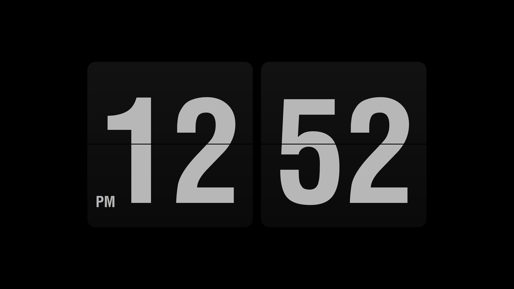
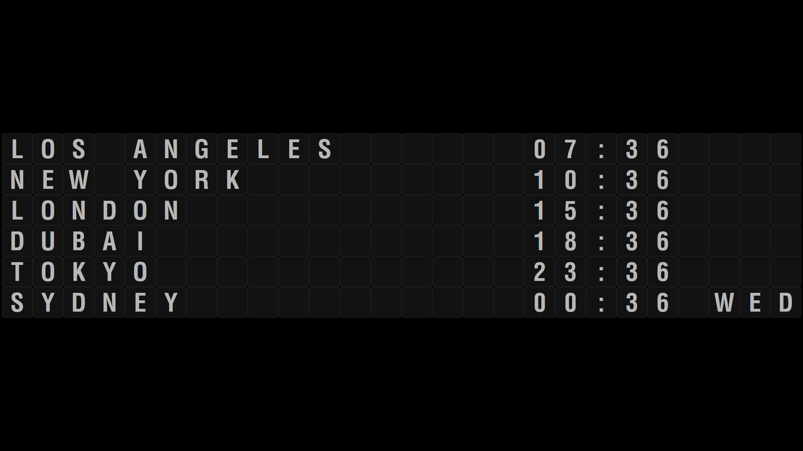

# flipsaver

Rust rewrite of the [FlipIt](https://github.com/phaselden/FlipIt)
flip-clock screensaver for Windows — itself inspired by the original
[Fliqlo](https://fliqlo.com/) by Yuji Adachi. A single small native
`.scr` with no runtime dependencies.



The flip clock runs on all monitors, with live preview, flip
animation, per-monitor orientation (horizontal/vertical/auto), and a
minimal settings dialog (12/24 h, size).

## World clocks



Any monitor can show a split-flap departure board of world times
instead of the clock: pick **World** for that screen in the settings
dialog. Each row is a city and its local time, with AM/PM (12 h mode)
and a day-of-week column when the zone's date differs from yours.

Six cities are preloaded (Los Angeles, New York, London, Dubai, Tokyo,
Sydney). Edit the `[WorldClocks]` section of `Settings.ini` to change
them — one `Label=Windows timezone name` line per row, shown in file
order:

```ini
[WorldClocks]
Hanoi=SE Asia Standard Time
Wellington=New Zealand Standard Time
```

Timezone names come from Windows (`tzutil /l` lists them); DST is
handled automatically. The board has its own size slider in the
settings dialog, independent of the clock size.

## Install

Build (see `docs/BUILDING.md`) or take a release `flipsaver.scr`, copy
it anywhere on a Windows 10 1703+ machine, right-click → Install. Or
test-run directly: `flipsaver.scr /s`.

Settings live in `%LOCALAPPDATA%\flipsaver\Settings.ini`.

## Font

If Helvetica LT Std Condensed (the font the original FlipIt uses) is
installed on the system, flipsaver uses it automatically. It is a
licensed font and is never shipped with the binary.

Otherwise digits render in
[Oswald](https://github.com/googlefonts/OswaldFont) Bold (static cut),
embedded in the binary. Licensed under the SIL Open Font License — see
`assets/OFL.txt`.

The settings dialog (`/c`) shows which font is in use; it is also
logged at startup via OutputDebugString (`flipsaver: font: ...`).
